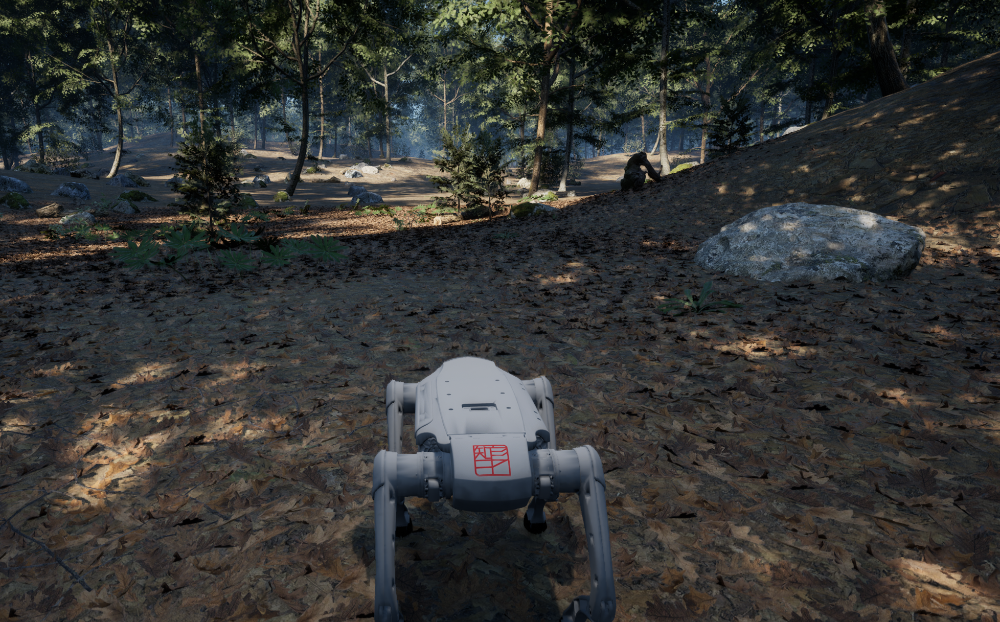
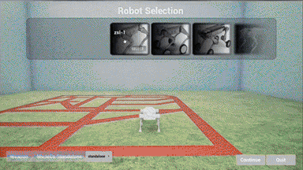
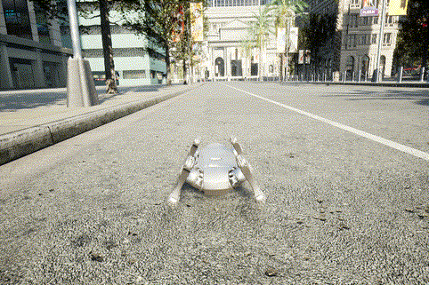
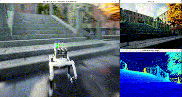
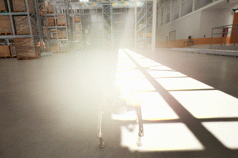
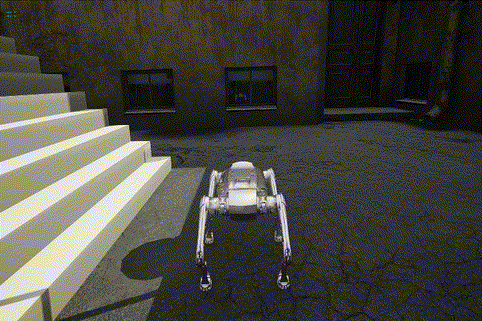

<strong>English</strong> | <a href="docs/README_CN.md">Simplified Chinese</a>

# MATRiX

**A High-Fidelity Robot Simulation Platform Powered by Unreal Engine and MuJoCo**

[Promotional Demo](#-promotional-demo) · [Quick Start](#-quick-start) · [Documentation](#-documentation) · [Robots & Maps](docs/Robots_and_Maps.md) · [Contributing](CONTRIBUTING.md)

MATRiX is a ready-to-run robot simulation platform. Unreal Engine provides high-fidelity rendering, MuJoCo runs the robot physics, and Zenoh carries ROS 2-compatible sensor and control payloads. The current source supports runtime MJCF loading, configurable sensor suites, embedded motion control, and DLC-based map discovery without requiring a ROS installation for the core simulator.

> [!IMPORTANT]
> The current release is **v1.0.7**. The source targets 64-bit Windows (DX12/SM6) and Linux (Vulkan/SM6). Hardware and driver requirements can vary by packaged release; see the [Getting Started guide](docs/Getting_Started_CN.md).

## 🎥 Promotional Demo

  
  

    <strong>MATRiX 2.0 Simulation Showcase</strong> 
    High-fidelity environments · Multi-robot simulation · Reinforcement learning · Real-world scene reconstruction
  

## ✨ Core Capabilities

- **Runtime MuJoCo integration:** Load MJCF/XML models at runtime and step physics on a dedicated worker (500 Hz target by default).
- **Complete sensor stack:** RGB, infrared, depth, fisheye, panorama, generic LiDAR, Mid360, Airy, IMU, GPS, and odometry with a unified ROS 2 timestamp model.
- **Embedded motion control:** Bundled control cores for `xgb`, `xg2`, `xgw`, `xgw2`, `zgws`, `zgwt`, and `zgwsarm`, plus a Linux shared-memory hardware-simulation path.
- **Runtime map DLCs:** Discover maps from `Saved/DLCs` or `Content/DLCs`; installed packages can be mounted at startup or loaded at runtime.
- **Zenoh and LAN networking:** ROS 2-compatible CDR payloads over Zenoh, fixed `mujoco/state` and `mujoco/cmd` control keys, and optional LAN state/event synchronization.
- **Graphical configuration:** Configure robot models, maps, initial poses, networking, motion control, and dynamic sensor arrays through the launcher-backed JSON configuration.

## 🎬 Simulation Gallery

<table>
<tr>
<td align="center"> Town10 Urban Environment</td>
<td align="center"> Venice Canal Environment</td>
</tr>
<tr>
<td align="center"> Warehouse Environment</td>
<td align="center"> Courtyard Environment</td>
</tr>
</table>

## 🚀 Quick Start

1. Download a runtime package: [Linux (access code: `6sth`)](https://pan.baidu.com/s/1I87hQ9C8XzIGXgbyWk3i9A?pwd=6sth) or [Windows (access code: `s9iy`)](https://pan.baidu.com/s/1JTMi2H8WMC2T8_8fbspjzA?pwd=s9iy).
2. Download the required map DLC packages and place the `.pak` files in `Windows/UeSim/Saved/DLCs/`.
3. Start MATRiX on Windows:

~~~powershell
.\Windows\UeSim\Binaries\Win64\UeSim.exe
~~~

Use the launcher to select a robot and scene, then configure the required sensors. The [Getting Started guide](docs/Getting_Started_CN.md) covers platform requirements, runtime layout, and verification steps.

If your runtime package includes the optional `Tools/` directory, a typical receiver setup is:

~~~powershell
pip install eclipse-zenoh opencv-python numpy
cd Tools
python zenoh_sensor_receiver.py
~~~

## 📚 Documentation

| Topic | Documentation |
|---|---|
| Installation and startup | [Getting Started (Chinese)](docs/Getting_Started_CN.md) |
| Robots and environments | [English](docs/Robots_and_Maps.md) · [Chinese](docs/Robots_and_Maps_CN.md) |
| Sensors and Zenoh | [Sensor and Communication (Chinese)](docs/Sensor_and_Communication_CN.md) |
| Sensor configuration | [Sensor Configuration Tutorial](docs/Sensor_Config_Tutorial.md) |
| Data tools | [Python Tools (Chinese)](docs/Python_Tools_CN.md) |
| Motion control | [Motion Control (Chinese)](docs/Motion_Control_CN.md) |
| Controllers | [Controller Guide](docs/Controller_Guide.md) · [Chinese](docs/Controller_Guide_CN.md) |
| Manual configuration | [Advanced Configuration (Chinese)](docs/Advanced_Configuration_CN.md) |
| Architecture and maintenance | [Maintainer Guide](docs/MAINTAINER_GUIDE.md) |
| Troubleshooting | [FAQ (Chinese)](docs/FAQ_CN.md) |
| Docker | [Docker Support Status](docs/Docker_Tutorial.md) |
| Pixel Streaming | [Pixel Streaming Guide](docs/pixelstreaming_tutorial.md) |
| Chinese documentation index | [Simplified Chinese](docs/README_CN.md) |

## 💬 Community

**Add the GENISOM AI WeChat assistant for MATRiX simulation discussions and support:**

  
  
<em>Scan to add XinQi Robo; mention MATRiX to join the simulation community.</em>

## 🤝 Contributing

Bug reports, documentation improvements, and runtime tooling changes are
welcome. Start with [CONTRIBUTING.md](CONTRIBUTING.md), and review the
[architecture and maintainer guide](docs/MAINTAINER_GUIDE.md) before changing
launch or release scripts. Security issues should follow [SECURITY.md](SECURITY.md)
rather than being filed as public issues.

## 🙏 Acknowledgements

This project builds upon the incredible work of the following open-source projects:

- [MuJoCo-Unreal-Engine-Plugin](https://github.com/oneclicklabs/MuJoCo-Unreal-Engine-Plugin)
- [MuJoCo](https://github.com/google-deepmind/mujoco)
- [Unreal Engine](https://github.com/EpicGames/UnrealEngine)
- [CARLA](https://carla.org/)
