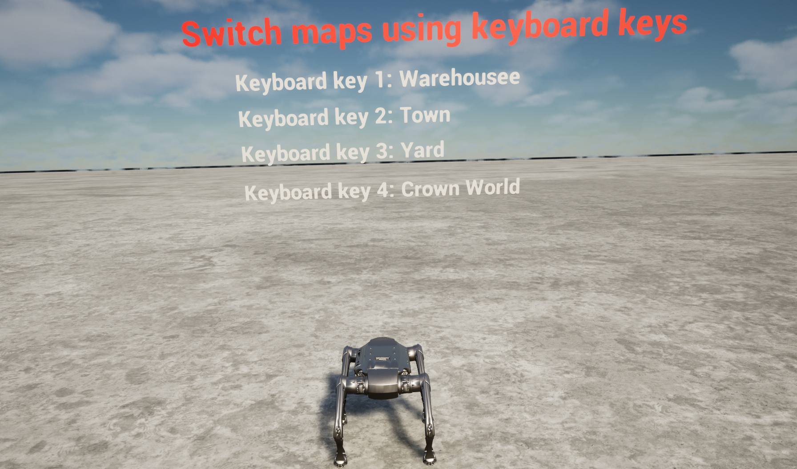

# Matrix

**Matrix** is a joint simulation toolkit built on top of **Unreal Engine 5 (UE5)** and **MuJoCo**.  
It provides a unified environment for **robotics research, reinforcement learning, and virtual-real interaction**, combining UE5’s high-fidelity rendering and physics effects with MuJoCo’s lightweight, differentiable physics engine.

---

## 📂 Directory Structure

```text
├── deps/                        # Third-party dependencies
│   ├── ecal_5.13.3-1ppa1~jammy_amd64.deb
│   ├── mujoco_3.3.0_x86_64_Linux.deb
│   ├── onnx_1.51.0_x86_64_jammy_Linux.deb
│   └── zsibot_common*.deb
├── scripts/                     # Build and configuration scripts
│   ├── build_mc.sh
│   ├── build_mujoco_sdk.sh
│   ├── download_uesim.sh
│   ├── install_deps.sh
│   └── modify_config.sh
├── src/
│   ├── jszr_mc/
│   ├── jszr_mujoco/
│   └── UeSim/
├── build.sh                     # One-click build script
├── run_sim.sh                   # Simulation launch script
└── README.md                    # Project documentation
```

---

## ⚙️ Environment Dependencies

- **Operating System:** Ubuntu 22.04  
- **Recommended GPU:** NVIDIA RTX 4080 or above  
- **Unreal Engine:** Integrated (no separate installation required)  
- **Build Environment:**  
  - GCC/G++ ≥ C++11  
  - CMake ≥ 3.16  
- **MuJoCo:** 3.3.2 open-source version (integrated)  
- **Remote Controller:** Required (Recommended: *Logitech Wireless Gamepad F710*)  
- **Python Dependency:** `gdown`  

---

## 🚀 Installation & Build

1. **Download the UE simulator**

    - **Method 1: Google Drive**
      ```bash
      gdown https://drive.google.com/uc?id=1abu-Vi_l0UAx-ji4isJAvj8rkoG7jZ_i
      ```

    - **Method 2: Baidu Netdisk**  
      [https://pan.baidu.com/s/1JD1G51MiagNlmNXf144w7g?pwd=6k1w](https://pan.baidu.com/s/1JD1G51MiagNlmNXf144w7g?pwd=6k1w)  

2. **Unzip**
   ```bash
   unzip <downloaded_filename>
   ```

3. **Install dependency**
   ```bash
   cd matrix
   ./build.sh
   ```
   *(includes dependency installation)*

---

## 🏞️ Demo Environments

- **Start Map**  
  

- **Warehouse**  
  

- **Town10**  
  

- **Yard**  
  

> **Note:** The above screenshots showcase high-fidelity UE5 rendering for robotics and reinforcement learning experiments.

---

## ▶️ Running the Simulation

### Headless Mode
```bash
./run_sim.sh offrender
```
- MuJoCo physics simulation window pops up  
- Unreal Engine runs in the background  
- Use ROS tools to view images:
  ```bash
  sudo apt install ros-humble-image-transport*
  rqt
  ```

### Rendering Mode
```bash
./run_sim.sh
```
- UE visualization window pops up  
- MuJoCo physics simulation window pops up  

---

## 🎮 Remote Controller Instructions

| Action                              | Controller Input                        |
|--------------------------------------|-----------------------------------------|
| Stand / Sit                         | Hold **LB** + **Y**                     |
| Move Forward / Back / Left / Right  | **Left Stick** (up / down / left / right)|
| Rotate Left / Right                 | **Right Stick** (left / right)          |
| Jump Forward                        | Hold **RB** + **Y**                     |
| Jump in Place                       | Hold **RB** + **X**                     |
| Somersault                          | Hold **RB** + **B**                     |

---

## 🔧 Configuration Guide

### 1. Update MuJoCo Scene
Edit the configuration file:
```bash
vim matrix/src/jszr_mujoco/simulate/config.yaml
```
Change:
```yaml
robot_scene: "scene_terrain.xml"
```
to one of:
```yaml
robot_scene: "scene_terrain_wh.xml"
robot_scene: "scene_terrain_t10.xml"
robot_scene: "scene_terrain_yard.xml"
```

---

### 2. Switch UE Map
Inside the Unreal Engine window:  
- Press **1 / 2 / 3 / 4** to switch maps (Start, Warehouse, Town10, Yard).

---

### 3. Adjust Sensor Configuration
Edit:
```bash
vim matrix/src/UeSim/jszr_mujoco_ue/Content/model/config/config.json
```

Example snippet:
```json
"sensors": {
  "camera": {
    "position": { "x": 29.0, "y": 0.0, "z": 1.0 },
    "rotation": { "roll": 0.0, "pitch": 15.0, "yaw": 0.0 },
    "sensor_type": "rgb",
    "topic": "/image_raw/compressed"
  },
  "depth_sensor": {
    "position": { "x": 29.0, "y": 0.0, "z": 1.0 },
    "rotation": { "roll": 0.0, "pitch": 15.0, "yaw": 0.0 },
    "sensor_type": "depth",
    "topic": "/image_raw/compressed/depth"
  },
  "lidar": {
    "position": { "x": 13.011, "y": 2.329, "z": 17.598 },
    "rotation": { "roll": 0.0, "pitch": 0.0, "yaw": 0.0 },
    "sensor_type": "mid360",
    "topic": "/livox/lidar"
  }
}
```

- Adjust **pose** and **number of sensors** as needed  
- Remove unused sensors to improve **UE FPS performance**

---

## 📡 Sensor Data Post-processing

- Depth camera publishes in `sensor_msgs::msg::CompressedImage` with **MONO8 encoding**  
- Convert to a single-channel grayscale (`int8`) image  
- Depth values are calculated as:  

```math
depth = pixel_value / 20
```

### Example Conversion Code
```cpp
void callback(const sensor_msgs::msg::CompressedImage::SharedPtr msg)
{
    cv_bridge::CvImagePtr cv_ptr;
    try {
        cv_ptr = cv_bridge::toCvCopy(msg, sensor_msgs::image_encodings::MONO8);
    } catch (cv_bridge::Exception & e) {
        RCLCPP_ERROR(this->get_logger(), "Image conversion failed: %s", e.what());
        return;
    }
    cv_ptr->image = cv_ptr->image / 20.0;
}
```