# Robots and Maps

[README](../README.md) | [中文](Robots_and_Maps_CN.md)

This page reflects the current `uesim` source tree. A packaged release may contain only a subset of source assets, and its DLCs must match the target platform and release version.

## Robot models

| Model key | MJCF assets | Embedded motion core | Notes |
|---|---:|---:|---|
| `go2` | Yes | No | Unitree Go2 model |
| `go2w` | Yes | No | Wheeled Go2 variant |
| `xgb` | Yes | Yes | UI/protocol label may appear as `xg`; supports jump actions |
| `xg2` | Yes | Yes | Second XG quadruped |
| `xgw` | Yes | Yes | Wheeled XG variant |
| `xgw2` | Yes | Yes | Second wheeled XG variant |
| `zgws` | Yes | Yes | Embedded Passive / Stand / Walk |
| `zgwt` | Yes | Yes | Embedded Passive / Stand / Walk |
| `zgwsarm` | Yes | Yes | UI label may appear as `zgws_arm` |

The model key must match the model directory and MJCF selected by `mujoco_model`. The embedded controller supports Passive, Stand, and Walk for all seven documented motion-controlled models; Jump and FrontJump are implemented only for `xgb`.

### Robot previews

<table>
  <tr>
    <td align="center">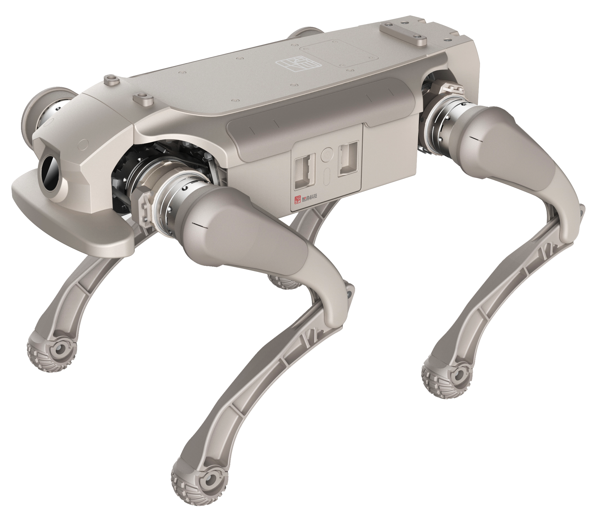<br/><code>xgb</code></td>
    <td align="center">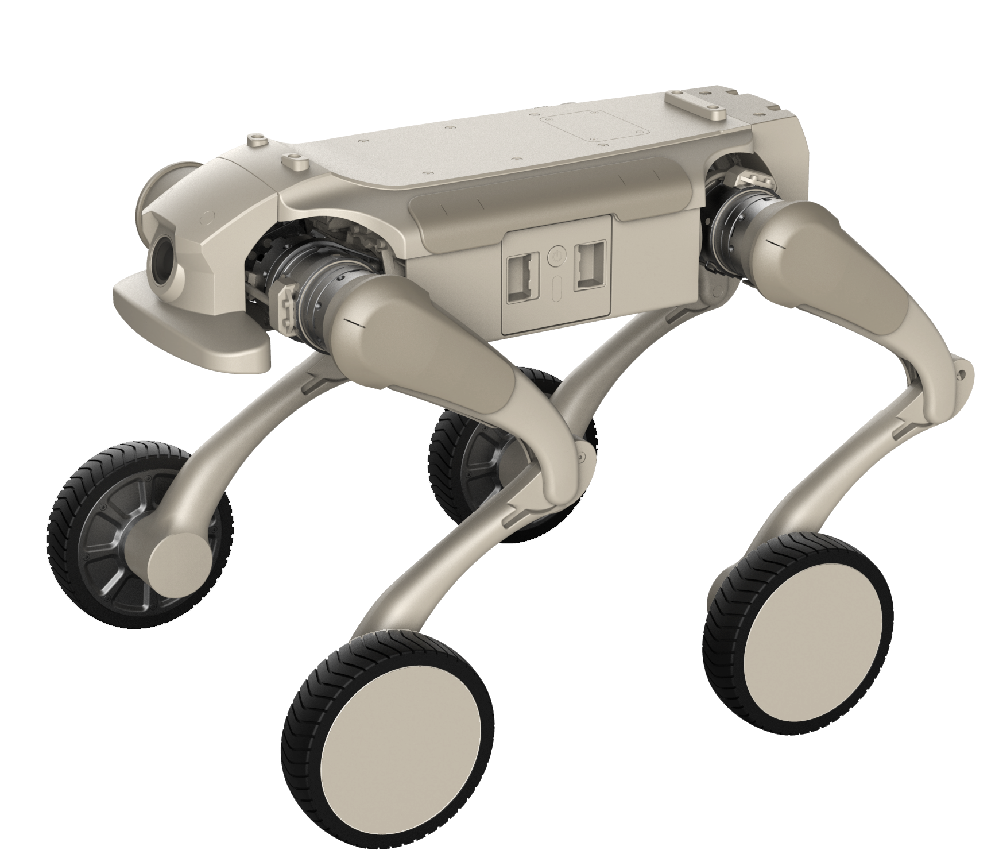<br/><code>xgw</code></td>
  </tr>
  <tr>
    <td align="center">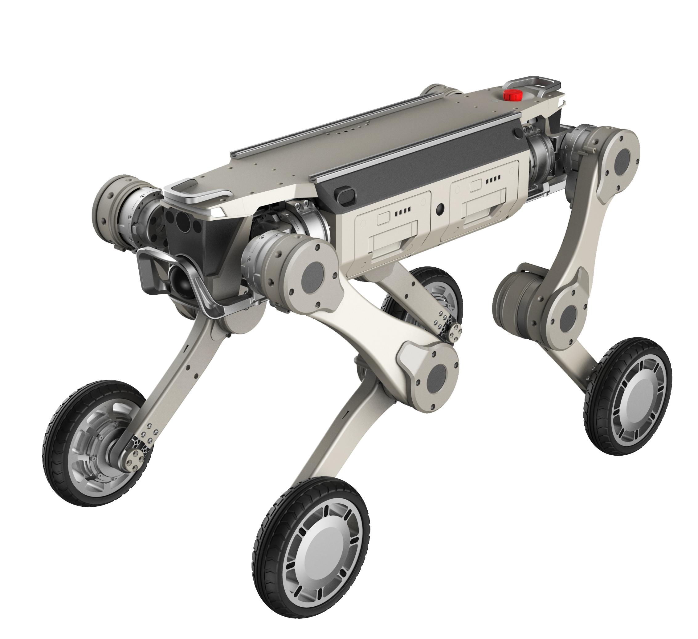<br/><code>zgws</code></td>
    <td align="center">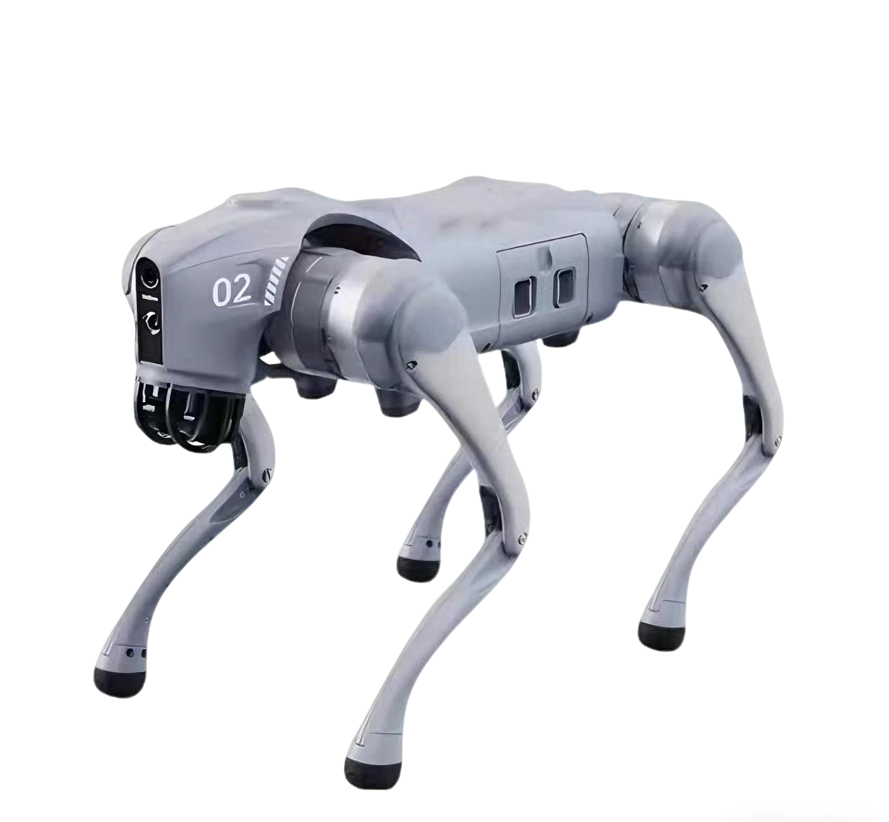<br/><code>go2</code></td>
  </tr>
  <tr>
    <td align="center">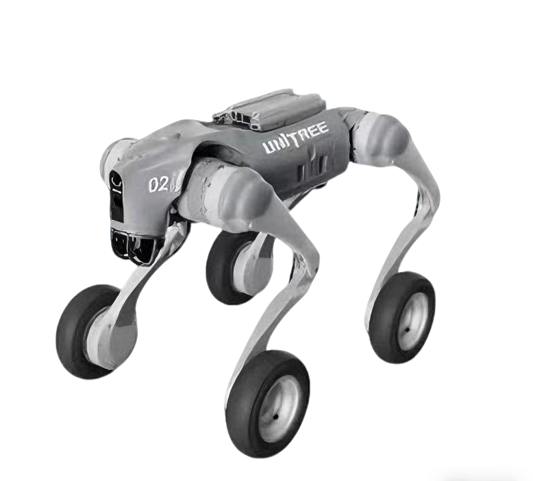<br/><code>go2w</code></td>
    <td></td>
  </tr>
</table>
## Maps in the source packaging list

`MainWorld` is the base/default map. The Windows bulk-packaging script currently lists these DLC maps:

| Group | Map names |
|---|---|
| Reconstructed and indoor | `3DGSWorld`, `ApartmentWorld`, `HouseWorld`, `House2World`, `MeetRoomWorld`, `OfficeWorld`, `SceneWorld` |
| Urban and outdoor | `BatuluWorld`, `CaliWorld`, `Custom2World`, `Town10World`, `VeniceWorld`, `YardWorld`, `ForestWorld` |
| Interaction and games | `CrowdWorld`, `RunningWorld`, `Town10Zombie`, `BloodWorld`, `DungeonWorld` |
| Competition and terrain | `IROSFlatWorld`, `IROSFlatWorld2025`, `IROSSlopedWorld`, `IROSSloppedWorld2025`, `MoonWorld`, `MarsWorld` |

Do not rely on the old numeric map IDs: runtime discovery and opening use asset/map names. The Linux bulk-packaging list can differ from the Windows list, and a public release can ship fewer DLCs than the source project contains.

The runtime also discovers maps through the asset registry, including HELIOS map locations. Extra maps such as calibration, home, or laboratory environments can therefore appear in a particular build even when they are not in the bulk DLC list above.

## DLC locations and loading

The runtime scans both locations recursively:

```text
Saved/DLCs/*.pak
Content/DLCs/*.pak
```

Installed DLCs are mounted during startup. The game instance also implements runtime operations to load a DLC file, enumerate available maps, and open an installed map. A restart is only needed when the packaged UI does not expose those operations or when a mount fails.

Use DLCs built for the same platform and compatible MATRiX release. A `.pak` from another platform or engine build may be discovered but fail to mount or open.

## Map previews

<table>
  <tr>
    <td>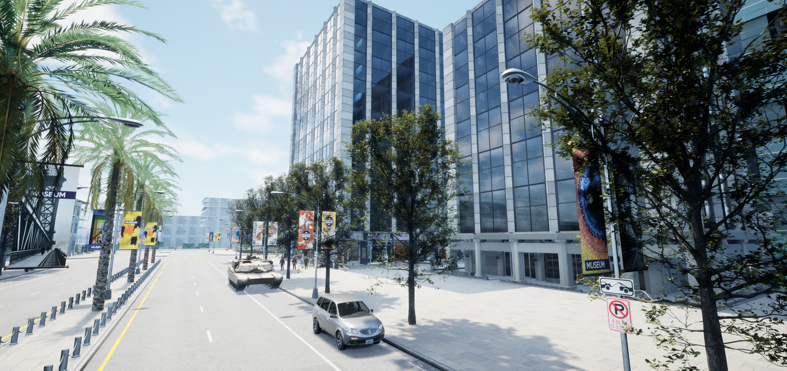<br/><code>Town10World</code></td>
    <td>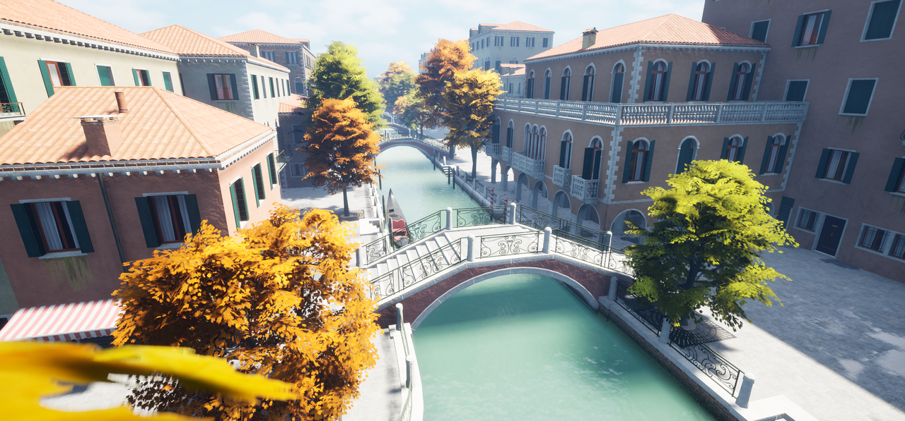<br/><code>VeniceWorld</code></td>
  </tr>
  <tr>
    <td>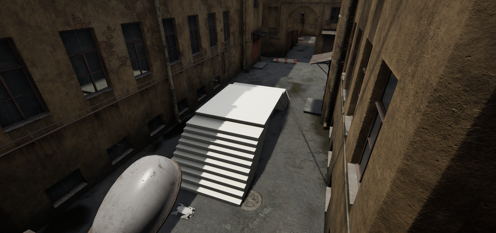<br/><code>YardWorld</code></td>
    <td>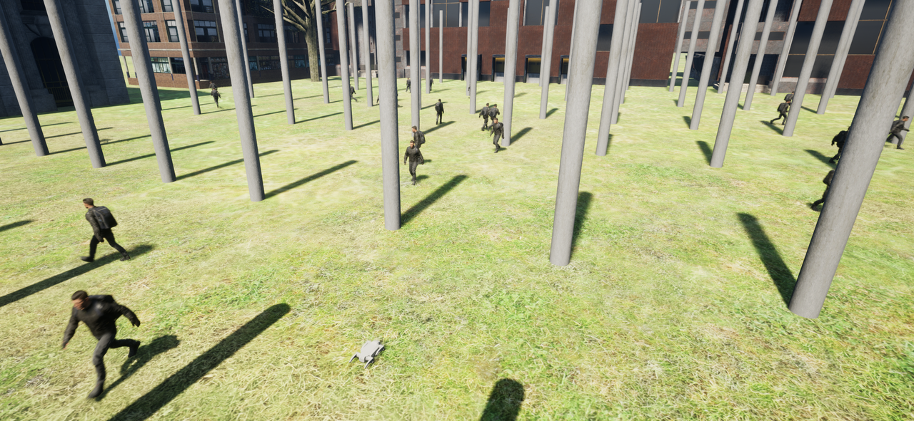<br/><code>CrowdWorld</code></td>
  </tr>
  <tr>
    <td>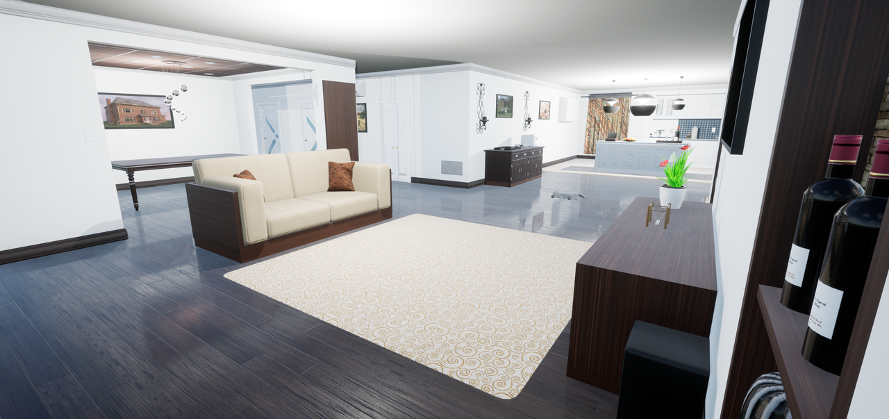<br/><code>HouseWorld</code></td>
    <td>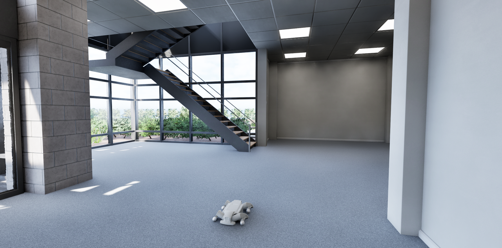<br/><code>OfficeWorld</code></td>
  </tr>
  <tr>
    <td>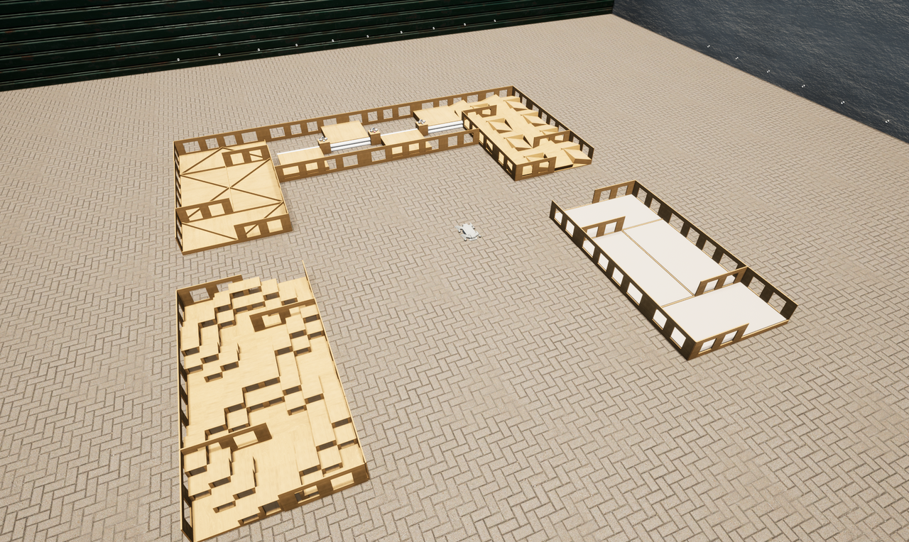<br/><code>IROSFlatWorld2025</code></td>
    <td>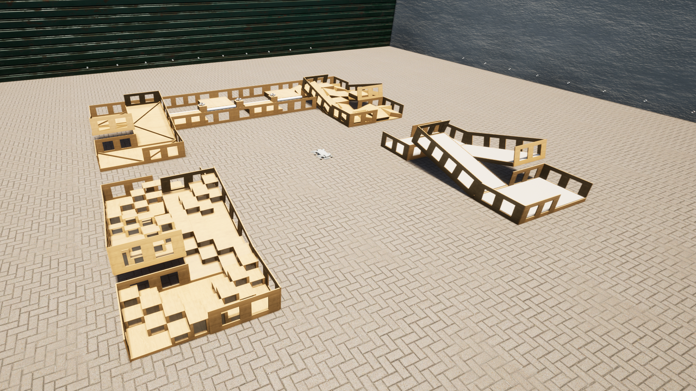<br/><code>IROSSloppedWorld2025</code></td>
  </tr>
  <tr>
    <td>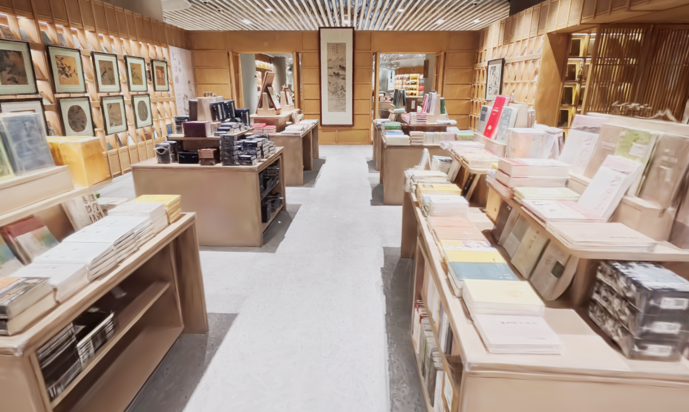<br/><code>3DGSWorld</code></td>
    <td>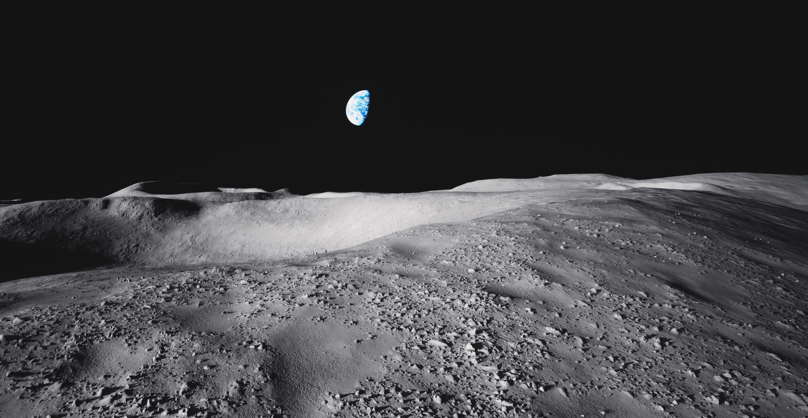<br/><code>MoonWorld</code></td>
  </tr>
</table>
